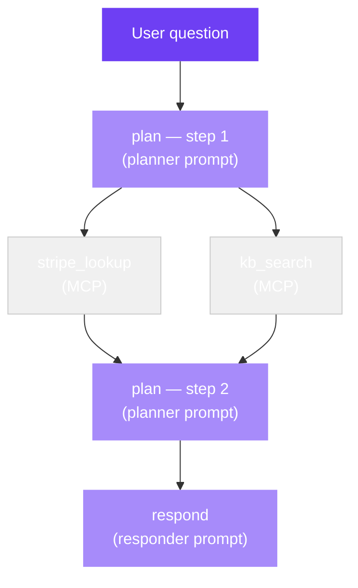

aevyra-witness captures what your agent did. It sits at the capture
layer of the Aevyra stack:

```
Witness  →  captures what happened         (you are here)
Verdict  →  judges it                      (aevyra-verdict)
Origin   →  finds where it went wrong      (aevyra-origin)
Reflex   →  fixes it                       (aevyra-reflex)
```

The output is an `AgentTrace` — a flat, ordered list of spans covering
every reasoning step, tool call, retrieval, and sub-agent invocation in
your pipeline. Every other Aevyra tool reads this format.

## Three ways to get a trace

**Instrument** — add `@span` decorators to your existing Python pipeline.
Zero dependencies, works in any framework:

```python
from aevyra_witness.runtime import span

@span("classify")
def classify(ticket): ...

@span("search_kb", optimize=True, prompt_id="kb_search_v2")
def search_kb(topic): ...
```

**Adapt** — your pipeline already emits logs. Parse them into an
`AgentTrace` without changing any agent code:

```python
from aevyra_witness.adapters import from_openclaw_jsonl, from_otel_spans

# OpenClaw JSONL telemetry
trace = from_openclaw_jsonl(Path("run.jsonl").read_text().splitlines())

# OpenTelemetry spans — covers LangGraph, CrewAI, AutoGen, Vercel AI SDK
trace = from_otel_spans(exporter.get_finished_spans())
```

**Intercept** — wrap a live session. Every MCP tool call is captured
automatically, with no decorators in your agent code:

```python
from aevyra_witness.interceptors import wrap_mcp_session

mcp = wrap_mcp_session(session, server_name="github")
result = await mcp.call_tool("create_issue", {"title": "Bug"})
trace = mcp.to_trace()
```

## What's in a trace



Each node is a `TraceNode` carrying the span's name, input, output,
kind (`reason`, `tool`, `retrieve`, `agent`), tokens used, start/end
timestamps, and an optional `prompt_id` for Reflex to target.

## Why a shared primitive

Verdict scores a trace. Origin attributes a trace's failure to specific
spans. Reflex rewrites the prompt behind those spans. All three need the
same representation — that's what `AgentTrace` is.

Without a shared primitive, each tool would have to parse your agent's
logs in its own way, and none of them would interoperate. With
`AgentTrace`, you instrument (or adapt) once and every downstream tool
just works.

<CardGroup cols={2}>
  <Card title="Quick start" icon="bolt" href="/witness/quickstart">
    Instrument a pipeline and get your first trace in 2 minutes
  </Card>
  <Card title="Adapters" icon="plug" href="/witness/adapters">
    Import existing logs — OpenClaw JSONL, OpenTelemetry
  </Card>
  <Card title="MCP interceptor" icon="network-wired" href="/witness/interceptors">
    Auto-capture MCP tool calls with no decorators
  </Card>
  <Card title="Trace schema" icon="brackets-curly" href="/witness/api/trace">
    AgentTrace and TraceNode field reference
  </Card>
</CardGroup>
